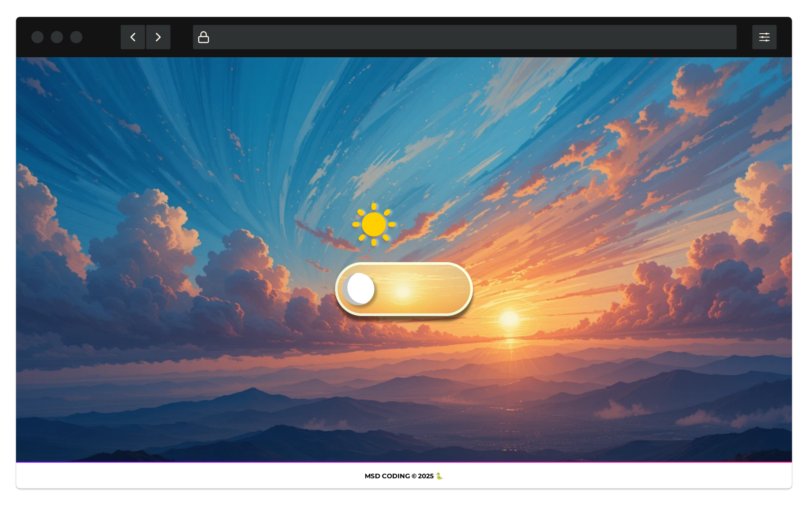

# Theme Slider 🌗

## Descrição
O **Theme Slider** é um projeto interativo que permite alternar entre dois temas (dia e noite) por meio de um slider estilizado. O fundo, as imagens e os elementos visuais mudam dinamicamente com a transição do tema.

## Funcionalidades

### 🔹 Estrutura HTML
- Uso de `meta tags` para responsividade e SEO
- Inclusão de um `favicon`
- Importação de fontes externas (`Google Fonts`)
- Estrutura semântica com `header`, `main` e `footer`
- Slider interativo com botões temáticos

### 🎨 Estilos CSS
- Design responsivo utilizando `@media queries`
- Transições suaves com `transition`
- Estilização do slider e botões dinâmicos
- Uso de `flexbox` para organização dos elementos na tela
- Sombras (`box-shadow`) e efeitos visuais

### 🛠️ Funcionalidades JavaScript
- Alternância dinâmica entre modo diurno e noturno
- Modificação de cores, imagens e estilos com `classList`
- Manipulação do DOM com `getElementById`
- Eventos de clique (`addEventListener`) para interatividade
- Animação do botão deslizante com `toggle`

## 📌 Como Executar o Projeto
1. Clone o repositório ou baixe os arquivos
   ```sh
   git clone https://github.com/seu-usuario/theme-slider.git
   ```
2. Abra o arquivo `index.html` no navegador
3. Clique no slider para alternar entre os temas

## 📸 Captura de Tela


## 📌 Tecnologias Utilizadas
- HTML5
- CSS3
- JavaScript
- Google Fonts

## 📄 Licença
Este projeto está sob a licença MIT. Sinta-se à vontade para usá-lo e modificá-lo!

---
### Autor
👨‍💻 Desenvolvido por [Matheus Duarte](https://www.linkedin.com/in/imatheusduarte/)

